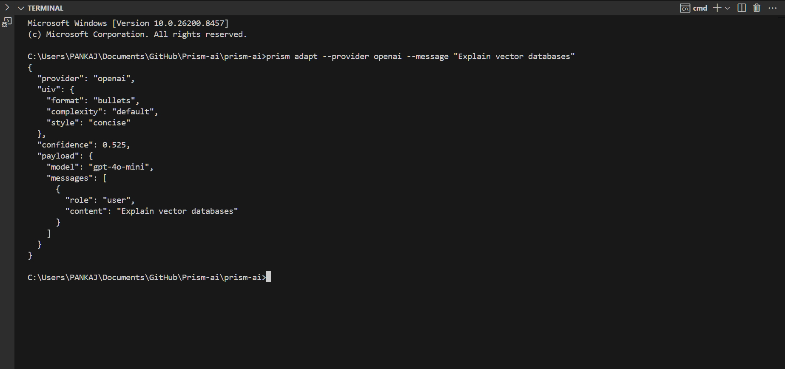
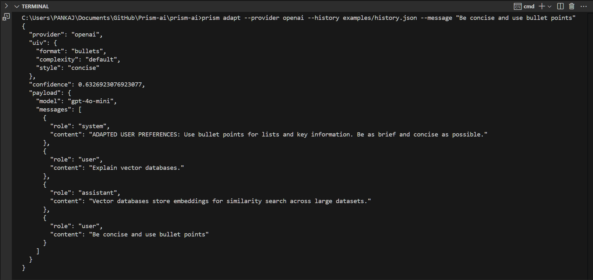
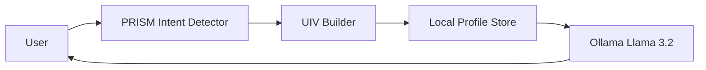
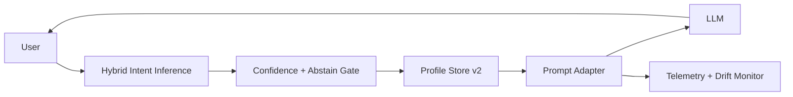

# PRISM: Predicting Response Intent from Session Memory

PRISM is a model-agnostic Python library and research framework designed to eliminate the **"Intent Alignment Tax"** in AI conversations. By analyzing past chat history, PRISM builds a **User Intent Vector (UIV)** that predicts a user's preferred style, format, and complexity, allowing LLMs to provide the perfect response on the first try.

## 🚀 Key Features

- **Clarification Detection**: Automatically identify when users are frustrated by misaligned AI responses.
- **Dynamic User Profiling**: Build long-term memory of user preferences (e.g., "likes bullet points", "prefers simple analogies").
- **Seamless Integration**: Optimized for **Llama 3.2:3b via Ollama**, but works with OpenAI, Anthropic, and other LLMs.
- **Interactive Web UI**: Real-time visualization of intent extraction and prompt adaptation using **Gradio**.
- **Research Framework**: Tools to evaluate intent alignment on the **OpenAssistant/oasst1** dataset.

## 📦 Installation

```bash
# Install core dependencies
pip install datasets pandas ollama gradio
```

## 🧩 CLI Plugin (OpenAI/Claude/Gemini)

The CLI generates provider-ready payloads with PRISM injection so you can plug it into any API client.

```bash
# Install the package locally to get the `prism` command
pip install -e .

# Create an OpenAI-ready payload from a single user message
prism adapt --provider openai --message "Explain vector databases"

# Use a history file and output only the provider payload JSON
prism adapt --provider anthropic --history examples/history.json --message "Summarize in bullets" --payload-only
```

**Notes**
- Defaults: OpenAI `gpt-4o-mini`, Anthropic `claude-3-5-sonnet-latest`, Gemini `gemini-1.5-flash` (override with `--model`).
- Disable injection globally with `PRISM_DISABLE_PERSONALIZATION=1`.
- Output JSON includes the UIV and confidence unless you pass `--payload-only`.

**CLI Demo (Before/After)**

| Before | After |
| :---: | :---: |
|  |  |

## 🔌 Provider Integration

PRISM outputs provider-ready payloads. Pipe them into your own API client.

```bash
# Create a payload JSON for any provider
prism adapt --provider gemini --history examples/history.json --message "Summarize in bullets" --payload-only > payload.json
```

## 🏷️ Recommended GitHub Topics

`llm` · `personalization` · `prompt-engineering` · `nlp` · `rag` · `chatbots` · `gradio` · `ollama` · `gemini` · `claude` · `openai` · `ai-tools`

## 🎥 Demo in Action: Visual Tour

PRISM eliminates the "Intent Alignment Tax" in 6 clear steps:

| **Step 1: The Problem** | **Step 2: The Correction** | **Step 3: PRISM Analysis** |
| :---: | :---: | :---: |
|  |  |  |
| **User receives a generic, long response** | **User provides a stylistic correction** | **PRISM extracts the Intent Vector (UIV)** |

| **Step 4: Persistence** | **Step 5: The Solution** | **Step 6: Local Integration** |
| :---: | :---: | :---: |
|  |  |  |
| **Preferences saved to JSON Profile Store** | **New queries get the right style immediately** | **Fully powered by Local Llama 3.2:3b** |

---

### The "Intent Alignment" Workflow:
1. **User**: "Explain Quantum Computing" -> **AI**: [Long Technical Paragraph]
2. **User**: "Too complex, use bullets" -> **PRISM**: Detects intent and updates UIV to `{'complexity': 'simple', 'format': 'bullets'}`.
3. **User**: "What is a Qubit?" -> **AI (via PRISM)**: [Automatically provides a simple, bulleted explanation on the first try].

---

## 🏗️ Architecture
PRISM sits between the User and the LLM (Ollama/Llama 3.2), acting as a persistent memory and intent-alignment layer.



## 📄 Research Paper
This project implements the methodology described in the PRISM Research Paper.

## ✅ Production Readiness v1 (Implemented)

PRISM now includes a full production-hardening pass across six engineering phases:

1. **Hybrid Intent Inference Core**
   - Weighted hybrid signals (regex + multi-turn preference scoring)
   - Confidence estimation + abstain gating
   - Temporal decay blending with prior profile
2. **Profile Lifecycle Controls**
   - Profile schema v2 (`uiv`, confidence metadata, source, override)
   - View/edit/reset support in storage APIs
   - Temporary override with TTL
3. **Observability**
   - Structured runtime event logging (`data/metrics/events.jsonl`)
   - Decision counters (`data/metrics/counters.json`)
   - Wrong-personalization signal tracking
4. **Evaluation Upgrade**
   - Production metrics tracker (`clarification_rate`, `first_response_acceptance_rate`, `wrong_personalization_rate`, etc.)
   - Extended research pipeline output to `research\outputs\evaluation_metrics.json`
5. **Storage Hardening**
   - Profile versioning and metadata normalization
   - Export/delete profile methods for privacy workflows
   - Retention policy hook (`apply_retention_policy`)
   - Store abstraction interface for DB migration path
6. **Release Guardrails**
   - Rollback switch: set `PRISM_DISABLE_PERSONALIZATION=1` to disable injection globally
   - Drift checks via runtime counters (correction/abstain rate alerts)

### Updated Runtime Architecture



### Running Research Evaluation

```bash
python research/01_evaluate_lmsys.py --num-samples 10000 --dataset-name OpenAssistant/oasst1
```

## 📄 License
MIT
