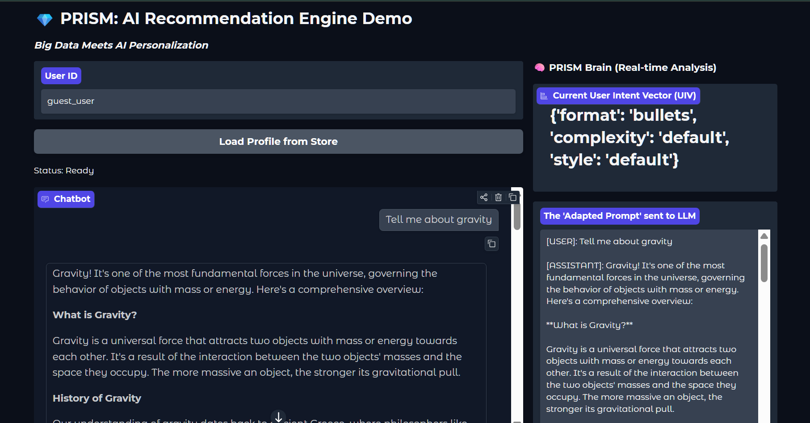
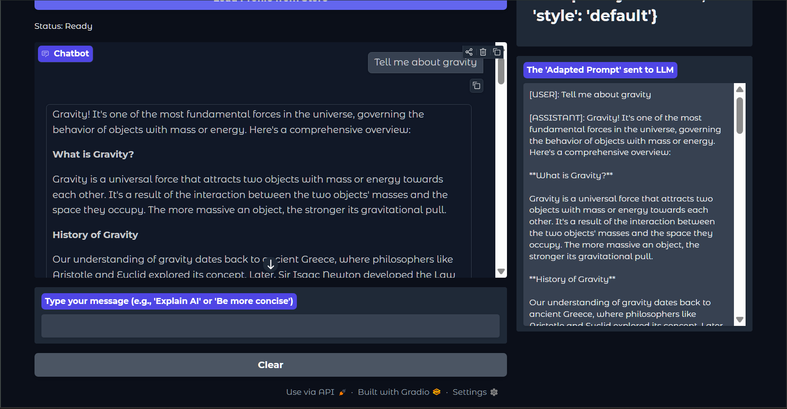
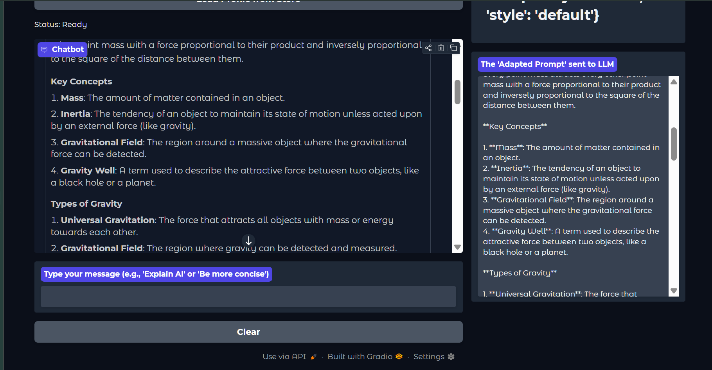
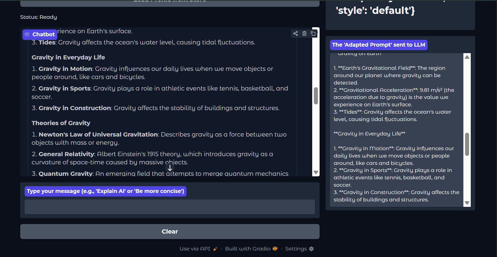
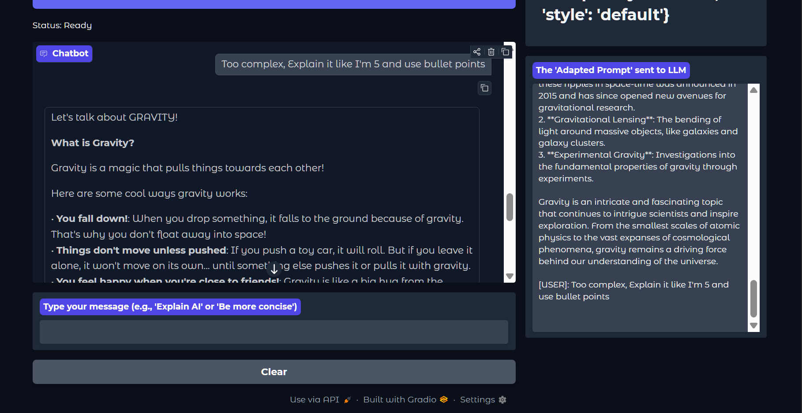
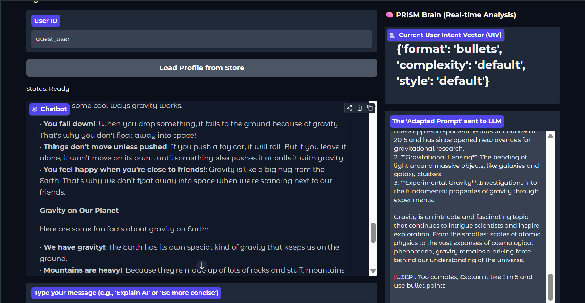
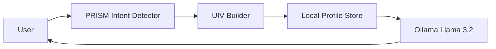

# PRISM: Predicting Response Intent from Session Memory

PRISM is a model-agnostic Python library and research framework designed to eliminate the **"Intent Alignment Tax"** in AI conversations. By analyzing past chat history, PRISM builds a **User Intent Vector (UIV)** that predicts a user's preferred style, format, and complexity, allowing LLMs to provide the perfect response on the first try.

## 🚀 Key Features

- **Clarification Detection**: Automatically identify when users are frustrated by misaligned AI responses.
- **Dynamic User Profiling**: Build long-term memory of user preferences (e.g., "likes bullet points", "prefers simple analogies").
- **Seamless Integration**: Optimized for **Llama 3.2:3b via Ollama**, but works with OpenAI, Anthropic, and other LLMs.
- **Interactive Web UI**: Real-time visualization of intent extraction and prompt adaptation using **Gradio**.
- **Research Framework**: Tools to evaluate intent alignment on the **OpenAssistant/oasst1** dataset.

## 📦 Installation

```bash
# Install core dependencies
pip install datasets pandas ollama gradio
```

## 🎥 Demo in Action: Visual Tour

PRISM eliminates the "Intent Alignment Tax" in 6 clear steps:

| **Step 1: The Problem** | **Step 2: The Correction** | **Step 3: PRISM Analysis** |
| :---: | :---: | :---: |
|  |  |  |
| **User receives a generic, long response** | **User provides a stylistic correction** | **PRISM extracts the Intent Vector (UIV)** |

| **Step 4: Persistence** | **Step 5: The Solution** | **Step 6: Local Integration** |
| :---: | :---: | :---: |
|  |  |  |
| **Preferences saved to JSON Profile Store** | **New queries get the right style immediately** | **Fully powered by Local Llama 3.2:3b** |

---

### The "Intent Alignment" Workflow:
1. **User**: "Explain Quantum Computing" -> **AI**: [Long Technical Paragraph]
2. **User**: "Too complex, use bullets" -> **PRISM**: Detects intent and updates UIV to `{'complexity': 'simple', 'format': 'bullets'}`.
3. **User**: "What is a Qubit?" -> **AI (via PRISM)**: [Automatically provides a simple, bulleted explanation on the first try].

---

## 🏗️ Architecture
PRISM sits between the User and the LLM (Ollama/Llama 3.2), acting as a persistent memory and intent-alignment layer.



## 📄 Research Paper
This project implements the methodology described in the PRISM Research Paper.

## 📄 License
MIT
